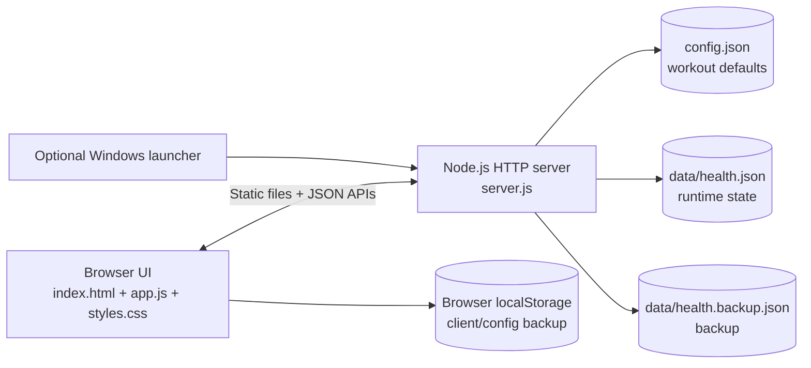

# Health Dashboard

*Local-first workout and body-metrics tracking with a small, dependency-free Node.js server.*


Health Dashboard is a browser-based workout planner and body-metrics tracker. The repository contains a small Node.js HTTP server, a static HTML/CSS/JavaScript client, editable workout configuration, local JSON persistence, and an optional Windows launcher. There is no package manifest and no third-party runtime package dependency.

> **Health data is sensitive.** Runtime state is stored under `data/` and may also be backed up in browser `localStorage`. The repository intentionally ignores runtime data; do not commit personal exports or populated state files.

## 🚀 Getting started

1. Install Node.js. The repository does **not** record the exact Node.js version originally used, so no specific version is claimed as tested.
2. Clone the repository.
3. From the repository directory, run:

   ```bash
   node server.js
   ```

4. Open `http://127.0.0.1:3000`.

On Windows, `launch_dashboard.bat` is an optional convenience launcher. It sets port `3003`, starts Node.js, waits for `/api/state`, and opens the system's configured browser when possible.

For complete setup, configuration, data-migration, and verification steps, see **[docs/SETUP.md](docs/SETUP.md)**. Hardware and software evidence is documented in **[docs/REQUIREMENTS.md](docs/REQUIREMENTS.md)**.

## What it does

- Plans recurring workout days and optional custom workout dates.
- Records cycling, walking, strength repetitions, and external load.
- Records body weight, body-fat percentage, muscle percentage, and profile height.
- Estimates workout energy use from configurable formulas.
- Shows recent/all-time progress summaries and a year calendar.
- Stores application state in local JSON files with a backup copy.
- Stores editable workout defaults in `config.json`.

The energy calculations are application estimates, not medical measurements or clinical guidance.

## 🧩 Architecture



The server binds to `127.0.0.1` by default. It serves only four static routes and three JSON API paths. See **[docs/ARCHITECTURE.md](docs/ARCHITECTURE.md)** for boundaries and data flow, and **[docs/architecture.svg](docs/architecture.svg)** for the high-resolution architecture infographic.

## 🔒 Security model

This project is designed for a trusted local machine, not as an authenticated multi-user web service.

- Default network bind: `127.0.0.1` only.
- No application-level authentication or authorization.
- State/configuration APIs can read or modify local health/configuration data.
- Runtime data is excluded by `.gitignore`.
- Responses include restrictive security headers and a same-origin Content Security Policy.
- Setting `HOST=0.0.0.0` (or another non-loopback address) deliberately broadens access and should only be done behind appropriate network and authentication controls.

See **[SECURITY.md](SECURITY.md)** before exposing the service beyond the local machine.

## Configuration and storage

`config.json` contains non-secret defaults for schedule days, visible-week ranges, theme, exercises, and calorie formulas. The web UI can update this file through `/api/config`.

Runtime health data is written to:

- `data/health.json` — primary state.
- `data/health.backup.json` — backup written alongside the primary state.
- browser `localStorage` — client-side recovery copies used by the application.

The application currently contains a fixed historical scheduling baseline in `app.js` (`START_DATE`). This behavior is part of the existing implementation; change it only after reviewing how it affects calendar/progress calculations.

## Documentation

- [Setup](docs/SETUP.md)
- [Requirements](docs/REQUIREMENTS.md)
- [Architecture](docs/ARCHITECTURE.md)
- [API](docs/API.md)
- [Troubleshooting](docs/TROUBLESHOOTING.md)
- [Security policy](SECURITY.md)
- [Contributing](CONTRIBUTING.md)
- [Public release checklist](docs/PUBLIC_RELEASE_CHECKLIST.md)

`docs/PROMPTING.md` is intentionally not included because the application has no AI/agent integration in the current codebase.

## Development verification

There is no automated test suite or package script in the repository. Before submitting a change, at minimum run:

```bash
node --check server.js
node --check app.js
node server.js
```

Then open the dashboard and exercise the affected UI/API path. See [CONTRIBUTING.md](CONTRIBUTING.md) for the repository-specific smoke-test checklist.

## License

Licensed under the **Apache License 2.0 subject to the Commons Clause 1.0**. Internal use, modification, and redistribution are permitted by the license terms; selling the software itself or a product/service whose value derives substantially from the software is restricted by the Commons Clause. Because of that additional sales restriction, the combined license is source-available rather than OSI-approved open source.

See [LICENSE](LICENSE) and [NOTICE](NOTICE).
