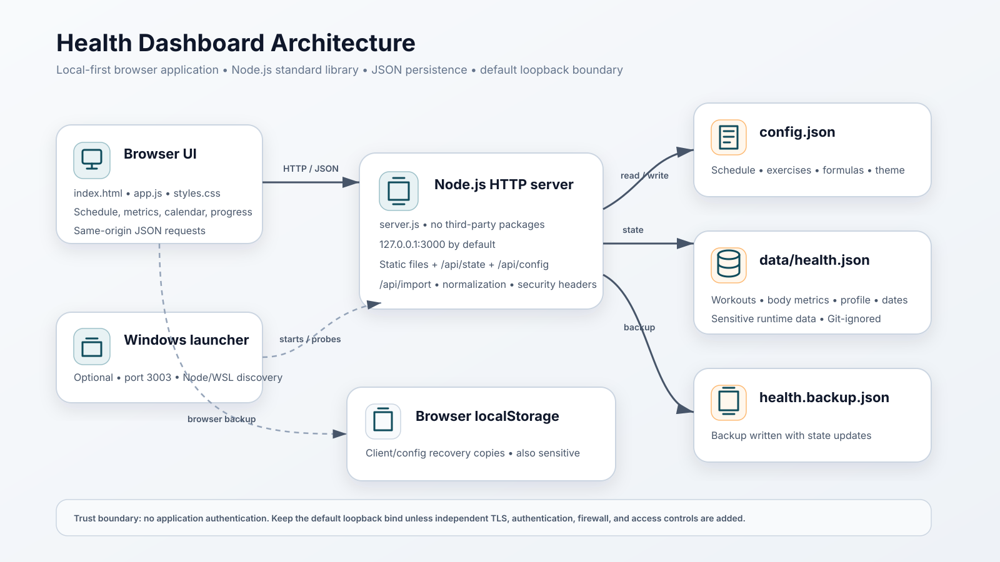
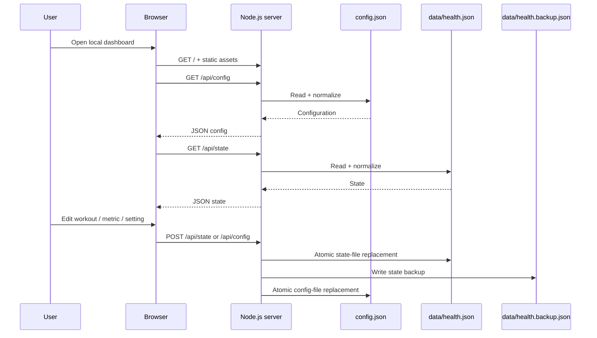

# Architecture

Health Dashboard is intentionally small: a static browser application communicates with a single-process Node.js HTTP server that persists JSON files on the same machine.

## Components

### Browser client

Files: `index.html`, `app.js`, `styles.css`

Responsibilities:

- render schedule, calendar, metrics, settings, and progress views;
- accept workout/profile/body-metric input;
- call same-origin JSON endpoints;
- keep client/config recovery copies in browser `localStorage`;
- calculate display summaries and calorie estimates from state/configuration.

### Node.js HTTP server

File: `server.js`

Responsibilities:

- bind to `HOST`/`PORT` (`127.0.0.1:3000` by default);
- serve the four static routes defined by `STATIC_FILES`;
- expose state/configuration/import JSON endpoints;
- create and update runtime JSON files;
- normalize incoming state and configuration;
- write a backup copy of health state;
- apply response security headers.

The server uses only Node.js standard-library modules.

### Configuration store

File: `config.json`

Contains editable non-secret defaults for workout schedule, visible weeks, theme, exercises, and calorie formulas. `POST /api/config` normalizes and rewrites this file.

### Runtime health store

Files under ignored `data/`:

- `health.json` — primary state;
- `health.backup.json` — backup state.

The state includes settings/profile values, workouts, metrics, custom dates, and a last-saved timestamp. These files can contain sensitive health information and must not be committed.

### Windows launcher

File: `launch_dashboard.bat`

An optional startup convenience layer. It is not required by the server architecture. It selects port `3003`, discovers Node.js or WSL, starts the server if the port is free, polls the API, and opens a browser.

## Request/data flow

## Trust boundaries

The main security boundary is the local host bind. There is no application authentication, so anyone who can reach the HTTP listener can use the JSON APIs. The hardened server defaults to loopback and applies browser security headers, but it does not become safe for arbitrary public-network exposure.

Browser `localStorage` is a second sensitive storage location. Clearing repository files does not clear browser-side backup state.

## Persistence behavior

State writes use a temporary file followed by rename for the primary `health.json`, then write a backup. Config writes similarly use a temporary file followed by rename. The application does not use a database, transaction log, encryption layer, or remote storage service.

## Current architectural constraints

- No authentication/authorization layer.
- No TLS endpoint in the Node.js server.
- No database or schema migration system.
- No package manager or dependency lock file.
- No automated test suite or CI configuration in the reviewed repository.
- `START_DATE` is a fixed client constant rather than a configuration field.

These are descriptions of the current code, not promised future features.
